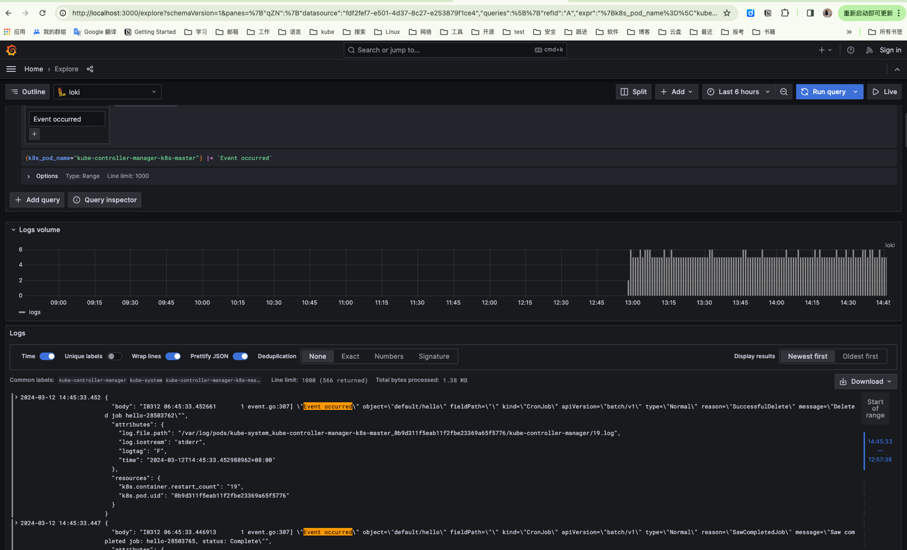

# contextual-logging-collector-demo
This is a demo of session [Leverage Contextual and Structured Logging in K8s for Enhanced Monitoring](https://kccnceu2024.sched.com/event/1YhhM/leverage-contextual-and-structured-logging-in-k8s-for-enhanced-monitoring-patrick-ohly-intel-gmbh-shivanshu-raj-shrivastava-adyen-mengjiao-liu-daocloud) at KubeCon + CloudNativeCon Europe 2024


## Demo Flow
- Step 1: Show the multicluster setup (show all the kind clusters)
- Step 2: Show different components that we are going to collect logs from (show pods)
- Step 3: Show text logs
- Step 4:change the logging format from text to json (change the logging format from text to json)
- Step 5: Show logs form any components in terminal producing strucutred or contetextual logs (here we show these JSON logs)

(so before, it will be text, once we change it to json for one component, it will be json)

- Step 6: Show opentelemetry collector and the configuration with filelog receiver to scrape logs from (basically show OTeL configmap) to Loki
  - here show that you are collecting logs from all the k8s pods, and show that you're sending it to Loki.(take component kube-scheduler or kube-controller-manager as an example)
- Step 7: Show logs on Grafana with Loki as datasource and show all the attributes injected by OTeL collector, say these can further be used for automation over these logs.


## Install 

###  Install Grafana and Loki
```
 docker-compose  -f loki-grafana-docker-compose.yaml  up -d
```

### setup clusters 

setup clusters  named cluster1,cluster2
```
kind create cluster --name=cluster1 --config=./setup-clusters/cluster.yaml

kind create cluster --name=cluster2 --config=./setup-clusters/cluster.yaml
```

### install open-telemetry collector

```
helm repo add open-telemetry https://open-telemetry.github.io/opentelemetry-helm-charts

kubectl create ns otel

helm install opentelemetry-collector open-telemetry/opentelemetry-collector -f otel-collector-ds-values.yaml --namespace otel 
```

#### check opentelemetry-collector-agent configmap

```
kubectl -n otel get cm opentelemetry-collector-agent  -o yaml
```

See opentelemetry-collector-agent-cm.yaml for example results.

## Demo 



see more details for KubeCon youtube demo video: https://www.youtube.com/watch?v=qdZA_TpIK68